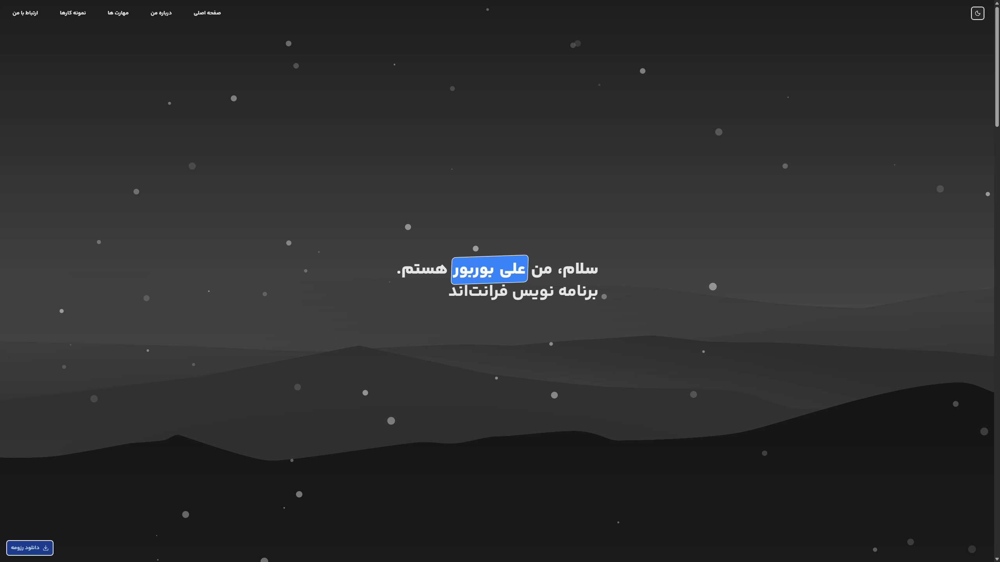
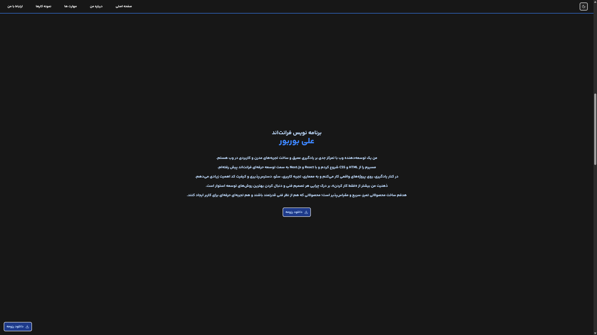
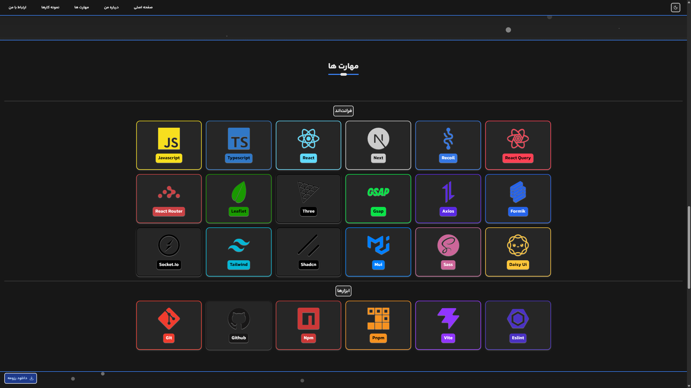

# 🧑‍💻 Ali BoorBoor — Portfolio


> A modern, animated, RTL developer portfolio built with React, TypeScript, Vite, Tailwind CSS, GSAP, Zustand, and reusable UI primitives.

Ali BoorBoor's portfolio is a single-page personal website designed to present a developer profile through a focused, interactive experience. It combines a Persian-first RTL layout with responsive navigation, theme persistence, smooth scrolling, scroll-triggered motion, particle effects, a skills showcase, project slider and resume access.

The project is intentionally organized around reusable components and feature-oriented modules, making the portfolio easier to maintain, extend, and adapt as the content grows.

## 🚀 Demo

### Live Application

**[Ali BoorBoor — Live Portfolio](https://portfolio-three-chi-l541bxyevl.vercel.app/)**

Explore the deployed portfolio and its main sections:

- 🏠 Intro / Hero
- 👨‍💻 About Me
- 🧠 Skills
- 🧩 Portfolio / Projects
- 🌓 Light & Dark Theme
- 📄 Resume Download

The repository is built as a client-side React application and is deployed as a Vite-powered site on Vercel.

## 🛠️ Technologies

### Frontend

| Technology         | Purpose                                         |
| ------------------ | ----------------------------------------------- |
| **React 19**       | Component-based UI development                  |
| **TypeScript 5.8** | Static typing and safer application code        |
| **Vite 7**         | Development server and production bundling      |
| **Tailwind CSS 4** | Utility-first styling and responsive layouts    |
| **GSAP 3**         | Advanced animation and scroll interactions      |
| **GSAP React**     | React integration for GSAP lifecycle management |
| **Lucide React**   | Interface icons                                 |
| **Embla Carousel** | Project/portfolio carousel behavior             |
| **tsParticles**    | Animated particle background                    |

### UI & Component System

| Technology                   | Purpose                                     |
| ---------------------------- | ------------------------------------------- |
| **Radix UI**                 | Accessible low-level UI primitives          |
| **Class Variance Authority** | Variant-driven component styling            |
| **Tailwind Merge**           | Safe Tailwind class composition             |
| **tw-animate-css**           | Animation utilities used alongside Tailwind |
| **clsx**                     | Conditional class names                     |

### State Management

| Technology  | Purpose                            |
| ----------- | ---------------------------------- |
| **Zustand** | Global theme state and persistence |

### Tooling

| Technology            | Purpose                                                       |
| --------------------- | ------------------------------------------------------------- |
| **ESLint 9**          | Code quality and linting                                      |
| **typescript-eslint** | TypeScript-aware ESLint rules                                 |
| **SWC**               | Fast React transforms through Vite                            |
| **npm / Bun**         | Package management / lockfile options used around the project |

## ✨ Features

### 🏠 Single-Page Portfolio Experience

The application is composed as one continuous portfolio page instead of a multi-route site. The main layout renders the following sections in order:

```text
Intro → About → Skills → Portfolio → Contact
```

This keeps the experience focused while allowing the fixed menu to jump between sections.

### 🌓 Persistent Theme Switching

The portfolio supports **light** and **dark** modes.

Theme state is managed with Zustand and persisted using the browser's local storage, so the selected theme survives page reloads.

```text
src/stores/useThemeStore.ts
src/hooks/useTheme.ts
```

The application initializes with a dark theme and applies the selected theme to the document root.

### 🎞️ Smooth Scrolling & Motion

GSAP is used as one of the core interaction layers of the site.

The project registers:

- `ScrollTrigger`
- `ScrollSmoother`
- `TextPlugin`
- `SplitText`
- `useGSAP`

The main layout creates a smooth scrolling container with normalized scrolling, while reusable animation hooks provide scroll-based entrance effects for individual sections.

The smooth-scroll setup also checks `prefers-reduced-motion` and skips the smoother when the user requests reduced motion.

### ✍️ Typewriter Effect

The intro area contains a dedicated feature module for typewriter-style text animation.

```text
src/features/typewriterEffect/
├── components/
├── hooks/
├── types/
└── index.ts
```

Keeping this interaction isolated makes the effect reusable instead of coupling it directly to the hero section.

### ❄️ Particle Background

An independent particles feature creates the animated visual background used by the portfolio.

```text
src/features/particlesBackground/
├── components/
├── hooks/
└── index.ts
```

The implementation is backed by `@tsparticles/react`, `@tsparticles/engine`, and the Snow preset.

### 🧠 Skills Showcase

The skills section is data-driven and divides technologies into categories:

- **Frontend**
- **Tools**

The current skills data includes technologies such as JavaScript, TypeScript, React, Next.js, React Query, React Router, Leaflet, Three.js, GSAP, Axios, Formik, Socket.IO, Tailwind CSS, shadcn/ui, MUI, Sass, DaisyUI, Git, GitHub, npm, pnpm, Vite, and ESLint.

Skills are rendered through reusable cards and category components instead of hardcoded markup in the main section.

### 🧩 Portfolio Slider

The portfolio section uses a dedicated slider module with Embla Carousel.

The project data is separated from the UI and currently defines **four project slides**, each with a title, description, image, technologies, and link target.

This architecture makes it straightforward to replace the placeholder project data with real projects later without rebuilding the section UI.

### 📄 Resume Download

A reusable `DownloadResumeButton` component is included and can be rendered as a fixed action, giving visitors persistent access to the resume throughout the page.

### 🧩 Reusable UI Architecture

The project contains a small UI system built on Radix primitives and reusable components such as:

- Button
- Badge
- Card
- Carousel
- Form
- Input
- Label
- Navigation Menu
- Separator
- Sheet
- Textarea

This gives the larger page sections a consistent component layer instead of duplicating low-level markup.

## 🏗️ Architecture

The project follows a **feature-oriented + component-oriented** architecture.

### `components/`

Contains shared presentation components and page templates.

```text
components/
├── templates/
│   ├── aboutMeSection/
│   ├── contactSection/
│   ├── introSection/
│   ├── menu/
│   ├── portfolioSection/
│   └── skillsSection/
│
├── ui/
├── DownloadResumeButton.tsx
├── SectionHeader.tsx
└── ThemeModeToggle.tsx
```

The `templates` directory contains larger page sections, while `ui` contains reusable building blocks.

### `features/`

Contains self-contained interactive features.

```text
features/
├── particlesBackground/
└── typewriterEffect/
```

Each feature owns its related components, hooks, types, and entry point where necessary.

### `hooks/`

Contains reusable application hooks.

```text
hooks/
├── useFadeInOnScrollAnimation.ts
└── useTheme.ts
```

The animation hook encapsulates GSAP-based reveal behavior, while the theme hook applies the persisted theme to the document.

### `lib/`

Contains shared infrastructure and utility functions.

```text
lib/
├── gsap.ts
└── utils.ts
```

The GSAP module centralizes plugin registration and exports the animation primitives used throughout the application.

### `stores/`

Contains global client-side state.

```text
stores/
└── useThemeStore.ts
```

The theme store uses Zustand's `persist` middleware with the `ui-theme` local-storage key.

### `types/`

Contains shared TypeScript types used across the application.

```text
types/
└── index.ts
```

Section-specific types are additionally colocated with their related feature/template modules.

## 🎬 Animation System

Animation is treated as a reusable part of the architecture rather than being embedded directly into every component.

### Global GSAP Setup

```ts
ScrollTrigger;
ScrollSmoother;
TextPlugin;
SplitText;
useGSAP;
```

All required GSAP plugins are registered in a single module:

```text
src/lib/gsap.ts
```

### Scroll Reveal Hook

Sections can use:

```ts
useFadeInOnScrollAnimation();
```

to get a ref that triggers a configurable fade/translate entrance animation through `ScrollTrigger`.

## 📸 Preview







## 📂 Project Structure

```text
Portfolio/
│
├── public/
│   ├── contact-icons/
│   ├── font/
│   ├── particles-images/
│   ├── tech-icons/
│   ├── portfolio-favicon.png
│   ├── robots.txt
│   └── sitemap.xml
│
├── src/
│   ├── components/
│   │   ├── templates/
│   │   │   ├── aboutMeSection/
│   │   │   ├── contactSection/
│   │   │   ├── introSection/
│   │   │   ├── menu/
│   │   │   ├── portfolioSection/
│   │   │   └── skillsSection/
│   │   └── ui/
│   │
│   ├── features/
│   │   ├── particlesBackground/
│   │   └── typewriterEffect/
│   │
│   ├── hooks/
│   │   ├── useFadeInOnScrollAnimation.ts
│   │   └── useTheme.ts
│   │
│   ├── lib/
│   │   ├── gsap.ts
│   │   └── utils.ts
│   │
│   ├── stores/
│   │   └── useThemeStore.ts
│   │
│   ├── types/
│   │   └── index.ts
│   │
│   ├── App.tsx
│   ├── Layout.tsx
│   ├── custom.css
│   ├── index.css
│   ├── main.tsx
│   └── vite-env.d.ts
│
├── .gitignore
├── bun.lock
├── components.json
├── eslint.config.js
├── index.html
├── package.json
├── tsconfig.app.json
├── tsconfig.json
├── tsconfig.node.json
└── vite.config.ts
```

## ⚙️ Scripts & Development

Install dependencies:

```bash
npm install
```

Start the development server:

```bash
npm run dev
```

Because the Vite script is configured with `--host`, the development server can be exposed to the local network for device testing.

Create a production build:

```bash
npm run build
```

Preview the production build locally:

```bash
npm run preview
```

Run ESLint:

```bash
npm run lint
```

## 🔍 SEO & Web Metadata

The project includes a basic production-oriented document setup in `index.html`:

- Persian language declaration
- RTL direction
- Responsive viewport configuration
- Custom favicon
- Meta description
- Portfolio page title
- `robots.txt`
- `sitemap.xml`

The current page metadata identifies the site as **Ali BoorBoor Portfolio** and describes it as a frontend developer portfolio focused on React, TypeScript, and modern web development.

## 🌐 Deployment

The portfolio is deployed with **Vercel**.

**Live:** https://portfolio-three-chi-l541bxyevl.vercel.app/

**Repository:** https://github.com/Ali-boorboor/Portfolio

## 👨‍💻 Author

Made with 💙 and plenty of frontend experimentation by **Ali BoorBoor**.

**Repository:** [github.com/Ali-boorboor/Portfolio](https://github.com/Ali-boorboor/Portfolio)

**Live Portfolio:** [portfolio-three-chi-l541bxyevl.vercel.app](https://portfolio-three-chi-l541bxyevl.vercel.app/)

---

⭐ If you found the project useful or interesting, consider giving the repository a star.
